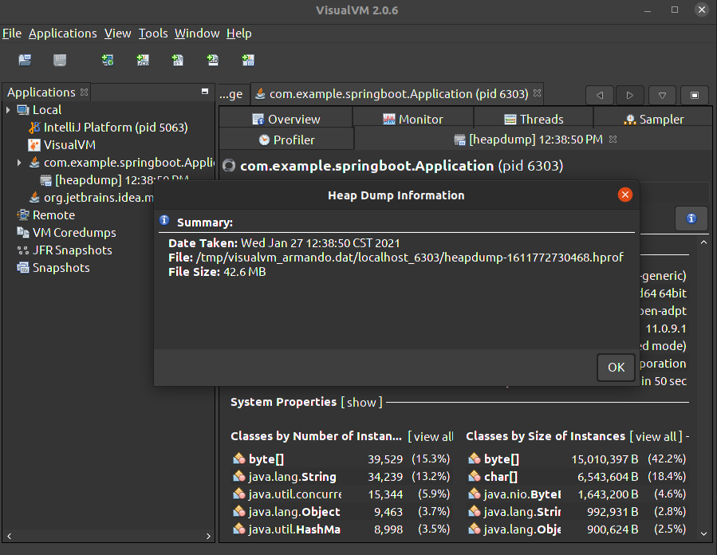

# Java Memory Test

Tooling Test resume,
- JVM, which ever you use for programming
- VisualVM, connects to JVM on runtime, facilitates,
  - Execute GC on specific
  - See Memory, CPU, Threads, Net consuming
  - Obtain a Heap dump on a specific time
- JMetter, simulates load, used in this example for test HTTP GET method
- MAT, Eclipse Memory Analyzer. Used to analize Heap dump files, facilitates identification of possible memory leaks identifying classes which consume more memory
- Java project: In this example a SpringBoot app was created exposing "/" path which resolves a string

## Pre requisites
- Install VisualVM
  - Download [here](https://github.com/oracle/visualvm/releases/download/2.0.6/visualvm_206.zip)
  - Uncompress, copy to /opt/visualvm/visualvm_version, create a Soft link to /usr/local/bin/visualvm
- Install JDK Manager
- Install Java 11
- Install IntelliJ
- Install JMetter
- Install MAT: Memory Analyzer
- Download App code [here](git@github.com:jarmandomtz/java-memory-test.git)

## Example App testing

```
% curl http://localhost:8080/
Greetings from Spring Boot!
```

## Memory analysis PoC
- Start IntelliJ, open de project and execute it using JVM11
- Open VisualVM and connect it to JVM of project execution. Check Heap usage and test Garbage Collector execution and consumption of Memory behavior
- Open JMetter, generate a Thread group, configure for 1 execution, add,
  - HTTP Header Manager
  - HTTP Request, using this properties: GET, http://localhost:8080/
  - Summary report: threads results in table format
- Execute Load Test. Configure Thread group to execute 200 concurrent request indefinitely
- See Memory Heap behavior. Go to VisualVM and see memory consumption, execute GC and see memory behavior
- Analyze Heap dump
  - On VisualVM, select JVM App and in "Monitor" Tab, press "Heap Dump", copy URL file
  - Open MemoryAnalyzer, and open URL file, select Leaks and get analysis

## Images section
---
IntelliJ


---
Memory Analyzer


---
JMetter


---
VisualVM



